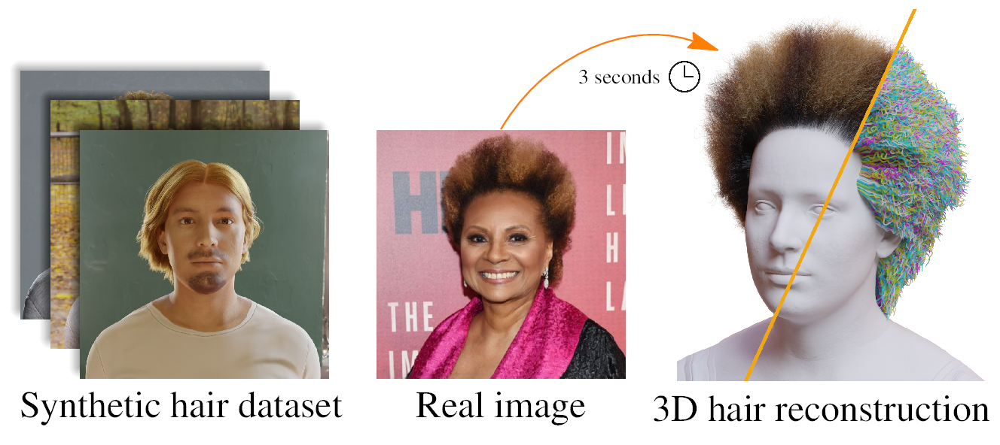

# difflocks-RE

Modernized DiffLocks for newer CUDA, newer attention kernels, and newer GPU architectures.

[**Paper**](https://arxiv.org/abs/2505.06166) | [**Project Page**](https://radualexandru.github.io/difflocks/)

<p align="middle">
  
</p>

`difflocks-RE` is a compatibility-focused rework of the original DiffLocks project. The goal of this version is to keep DiffLocks usable on newer software and hardware stacks, especially newer CUDA environments and newer NVIDIA architectures such as RTX 50-series GPUs.

Compared with the original release, this version updates the runtime assumptions around PyTorch, CUDA, NATTEN, FlashAttention, and Blender export so the project can run reliably in a more modern setup without falling back to an older CUDA stack.

This repository still provides the DiffLocks inference and training code for generating strand-based 3D hair from a single image, together with support for the DiffLocks dataset.

## What difflocks-RE Changes

- Updates the environment to a modern CUDA `12.8` stack.
- Uses a newer PyTorch CUDA 12.8 build instead of the older CUDA 12.4-era setup.
- Pins newer custom attention dependencies required for current hardware:
  - `NATTEN 0.21.5+torch2100cu128`
  - `FlashAttention 2.8.3+cu12torch2.11`
- Fixes compatibility with newer NATTEN APIs so inference no longer depends on removed legacy symbols.
- Improves compatibility with newer NVIDIA architectures, including modern RTX cards such as the RTX 50 series.
- Updates Blender export behavior so `.abc` export works in newer environments, including WSL calling a Windows Blender install.
- Keeps the workflow close to the original project while making it practical to run efficiently on a newer machine.

## Tested Environment

This README documents the working setup used in this repository right now.

- OS: Linux / WSL
- Python: `3.12`
- CUDA: `12.8`
- PyTorch: `2.11.0+cu128`
- torchvision: `0.26.0+cu128`
- torchaudio: `2.11.0+cu128`
- NATTEN: `0.21.5+torch2100cu128`
- FlashAttention: `2.8.3+cu12torch2.11`

Important:

- You must install CUDA `12.8`.
- You must use the exact NATTEN and FlashAttention wheels listed below.
- Do not mix this setup with older CUDA 12.4 / 12.6 wheels.

## Requirements

### 1. Install CUDA 12.8

Install NVIDIA CUDA `12.8` on the machine first. This setup is intended for CUDA 12.8 and the custom attention kernels below are tied to that version.

### 2. Create a virtual environment

```bash
python3 -m venv ./difflocks_env
source ./difflocks_env/bin/activate
python -m pip install --upgrade pip setuptools wheel
```

### 3. Install PyTorch for CUDA 12.8

Install PyTorch from the CUDA 12.8 wheel index:

```bash
pip install torch torchvision torchaudio --index-url https://download.pytorch.org/whl/cu128
```

The working environment documented in this repo currently resolves to:

- `torch==2.11.0+cu128`
- `torchvision==0.26.0+cu128`
- `torchaudio==2.11.0+cu128`

Reference: PyTorch CUDA 12.8 wheels are published through the official PyTorch wheel index and version pages.

### 4. Install the Python dependencies from this repo

```bash
pip install -r ./requirements.txt
```

### 5. Install the required custom attention wheels

These two dependencies are required for the current setup and should be installed with these exact versions:

```bash
pip install "https://github.com/SHI-Labs/NATTEN/releases/download/v0.21.5/natten-0.21.5%2Btorch2100cu128-cp312-cp312-linux_x86_64.whl"
pip install "https://github.com/lesj0610/flash-attention/releases/download/v2.8.3-cu12-torch2.11/flash_attn-2.8.3%2Bcu12torch2.11cxx11abiTRUE-cp312-cp312-linux_x86_64.whl"
```

If you already downloaded the wheels locally, you can also install them from files instead of URLs.

### 6. Verify the environment

```bash
python - <<'PY'
import torch, natten, flash_attn
print("torch:", torch.__version__)
print("cuda:", torch.version.cuda)
print("cuda_available:", torch.cuda.is_available())
print("natten:", natten.__version__)
print("flash_attn:", getattr(flash_attn, "__version__", "unknown"))
PY
```

Expected core values for this setup:

- `torch: 2.11.0+cu128`
- `cuda: 12.8`
- `natten: 0.21.5`

## Download Pretrained Checkpoints

Download the pretrained checkpoints with:

```bash
./download_checkpoints.sh
```

## Inference

Run inference on a single image with:

```bash
python inference_difflocks.py \
  --img_path ./samples/medium_11.png \
  --out_path ./outputs_inference/
```

This writes outputs under a per-image subfolder:

- `./outputs_inference/<image_name>/`

Inside that folder you will get:

- `<image_name>_difflocks_output_strands.npz`
- `<image_name>_scalp_texture.npz`
- `<image_name>_rgb.png`
- `<image_name>.json`

## Export `.abc` and `.blend`

If Blender is available, pass `--blender_path` and the script will export:

- `<image_name>.abc`
- `<image_name>.blend`

Example on Linux:

```bash
python inference_difflocks.py \
  --img_path ./samples/medium_11.png \
  --out_path ./outputs_inference/ \
  --blender_path /path/to/blender
```

Example on WSL using a Windows Blender installation directory:

```bash
python inference_difflocks.py \
  --img_path ./samples/medium_11.png \
  --out_path ./outputs_inference/ \
  --blender_path "C:\Program Files (x86)\Steam\steamapps\common\Blender"
```

Notes:

- `--blender_path` can point either to the Blender executable or to the Blender installation directory.
- In the current repo setup, providing `--blender_path` is enough to export `hair.abc`; you do not need to manually add `--export_alembic`.
- This flow has been tested with Windows Blender `5.1` launched from WSL.
- For Unreal Engine, add `--ue` to rotate the export for correct orientation (x=-90, z=180).

## Unreal Engine Groom Import (Rendering + Physics)


This section describes a minimal, practical workflow for importing the exported `.abc` into UE and enabling Groom rendering and physics.

1. Enable plugins:
   - In UE, open `Edit > Plugins`.
   - Enable `Groom` and `Alembic Groom Importer`.
   - Restart the editor if prompted.

2. Import the Alembic Groom:
   - Drag `<image_name>.abc` into the Content Browser.
   - In the import options, choose `Groom` as the asset type.
   - If you did not use `--ue`, set the import rotation to `X=-90`, `Z=180`.
     If you used `--ue`, you can keep the import rotation at defaults.


3. Add the Groom to your character:
   - Open your character Blueprint.
   - Add a `Groom Component` and assign the Groom asset.

4. Enable hair physics (basic setup):
   - Open the Groom asset and enable simulation settings as needed.
   - Ensure your character has a Physics Asset (for collisions).
   - In the Groom asset, set the physics/collision settings to use that Physics Asset.

Tips:
- If hair flips or points the wrong way, use the `--ue` export flag.
- If physics looks unstable, reduce strand count or lower simulation stiffness.

## Dataset


The DiffLocks dataset contains 40K hairstyles. Each sample includes 3D hair geometry, a rendered RGB image, and metadata for the hair asset.

Download the dataset with:

```bash
./download_dataset.sh <DATASET_PATH_CONTAINING_ZIPPED_FILES>
```

After downloading, unpack and preprocess it:

```bash
./data_processing/uncompress_data.py --dataset_zipped_path <DATASET_PATH_CONTAINING_ZIPPED_FILES> --out_path <DATASET_PATH>
./data_processing/create_chunked_strands.py --dataset_path <DATASET_PATH>
./data_processing/create_latents.py --dataset_path <DATASET_PATH> --out_path <DATASET_PATH_PROCESSED>
./data_processing/create_scalp_textures.py --dataset_path <DATASET_PATH> --out_path <DATASET_PATH_PROCESSED> --path_strand_vae_model ./checkpoints/strand_vae/strand_codec.pt
```

## Train StrandVAE

```bash
python train_strandsVAE.py --dataset_path <DATASET_PATH> --exp_info <EXP_NAME>
```

TensorBoard logs are written to `./tensorboard_logs`.

## Train the Diffusion Model

```bash
python train_scalp_diffusion.py \
  --config ./configs/config_scalp_texture_conditional.json \
  --batch-size 4 \
  --grad-accum-steps 4 \
  --mixed-precision bf16 \
  --use-tensorboard \
  --save-checkpoints \
  --save-every 100000 \
  --compile \
  --dataset_path <DATASET_PATH> \
  --dataset_processed_path <DATASET_PATH_PROCESSED> \
  --name <EXP_NAME>
```

For multi-GPU training:

```bash
accelerate config
accelerate launch train_scalp_diffusion.py \
  --config ./configs/config_scalp_texture_conditional.json \
  --batch-size 4 \
  --grad-accum-steps 4 \
  --mixed-precision bf16 \
  --use-tensorboard \
  --save-checkpoints \
  --save-every 100000 \
  --compile \
  --dataset_path <DATASET_PATH> \
  --dataset_processed_path <DATASET_PATH_PROCESSED> \
  --name <EXP_NAME>
```

Adjust `batch-size` and `grad-accum-steps` based on your GPU memory and GPU count.
